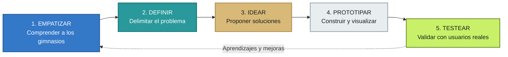
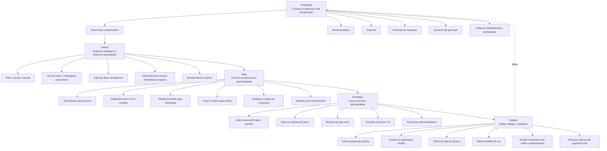
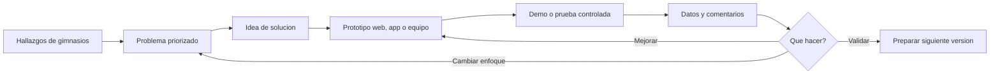

# Diagrama de Prototipado Design Thinking

**Proyecto:** Project-GymGo  
**Empresa:** SIRID Systems  
**Enfoque:** Solucion B2B para gimnasios mediante una plataforma digital y un dispositivo fisico de control de acceso.

## Ciclo completo

## Aplicacion al proyecto

## 1. Empatizar

### Objetivo

Comprender como trabajan actualmente los gimnasios y que problemas enfrentan en acceso, rutinas, control operativo y mantenimiento.

### Personas principales

| Persona | Necesidad que se investiga |
|---|---|
| Administrador | Controlar afluencia, membresias, equipo y operacion |
| Coach | Crear y asignar rutinas sin depender de hojas o mensajeria |
| Recepcionista | Validar accesos rapidamente y resolver incidencias |
| Usuario del gimnasio | Entrar sin friccion y seguir su entrenamiento |
| Personal de mantenimiento | Recibir avisos oportunos sobre equipos dañados |

### Actividades

- Entrevistas con gimnasios de Mixquiahuala, Tlaxcoapan, Tlahuelilpan, Progreso y alrededores.
- Observacion del proceso de entrada y salida.
- Identificacion de herramientas actuales: hojas, grupos de mensajeria y controles manuales.
- Registro de dudas, frustraciones y tareas repetitivas.
- Analisis de como se decide la compra o renta de tecnologia.

### Entregables

- Entrevistas documentadas.
- Mapa de actores.
- Customer journey del gimnasio.
- Lista de problemas observados.

## 2. Definir

### Problema principal

> Los gimnasios necesitan controlar mejor el acceso, la operacion y la informacion de sus usuarios, pero actualmente dependen de procesos manuales que dificultan tomar decisiones y ofrecer una experiencia conectada.

### Punto de vista

> Un administrador de gimnasio necesita una plataforma sencilla que conecte el acceso fisico con la informacion operativa, porque requiere reducir tareas manuales, conocer la afluencia y aprovechar mejor sus recursos.

### Preguntas de oportunidad

- ¿Como podriamos agilizar el acceso sin aumentar la carga de recepcion?
- ¿Como podriamos conectar el lector fisico con la app movil?
- ¿Como podriamos ayudar al coach a crear rutinas desde un solo lugar?
- ¿Como podriamos convertir los accesos en informacion util para el gimnasio?
- ¿Como podriamos presentar una solucion profesional sin exigir una gran inversion inicial?

### Criterios de exito

- El acceso mediante QR es rapido y entendible.
- El administrador puede consultar informacion util.
- El coach puede crear rutinas sin herramientas externas.
- El equipo puede venderse o rentarse.
- El gimnasio puede solicitar una demostracion y entender la propuesta.

## 3. Idear

### Soluciones priorizadas para la primera etapa

1. Web comercial para presentar Project-GymGo.
2. Solicitud de demostracion presencial gratuita.
3. Suscripcion mensual para el uso de la plataforma.
4. Compra o renta del dispositivo de control de acceso.
5. QR generado por la app movil y validado por el lector fisico.
6. Panel inicial de administracion y estadisticas.
7. Coach Creator para crear y asignar rutinas.
8. Reportes de mantenimiento.

### Ideas para etapas posteriores

- Sustitucion inteligente de ejercicios.
- Mapas de calor por zonas y equipos.
- Gamificacion y rachas.
- Notificaciones push y upselling.
- Integracion NFC con Apple Wallet y Google Wallet.
- IA para analizar postura y tecnica mediante video.

## 4. Prototipar

### Prototipo actual de la web

| Elemento | Proposito |
|---|---|
| Landing page | Explicar el valor comercial de Project-GymGo |
| Seccion de soluciones | Presentar la plataforma para gimnasios |
| Pagina de hardware | Explicar el lector de acceso IoT |
| Planes | Mostrar precios de ejemplo o solicitar cotizacion |
| Demo | Solicitar demostracion presencial gratuita |
| Contacto | Comunicar por WhatsApp o correo |
| Mapa | Mostrar cobertura regional |

### Prototipo futuro de la app

- Flujo de registro del usuario del gimnasio.
- Generacion de QR dinamico.
- Pantalla de check-in y check-out.
- Rutina asignada por el coach.
- Registro de series, repeticiones, peso y descanso.
- Panel de ocupacion y disponibilidad.
- Reporte de fallas de equipos.

### Prototipo fisico

- Lector ubicado en la entrada.
- Lectura de QR generado por la app.
- Indicador de acceso autorizado o rechazado.
- Registro de entrada para el sistema.
- Posible teclado como respaldo.

## 5. Testear

### Pruebas de la web comercial

- Mostrar la página a administradores de gimnasios.
- Medir si entienden que SIRID Systems vende una solucion B2B.
- Comprobar si distinguen entre compra y renta del equipo.
- Verificar si encuentran facilmente el boton de demostracion.
- Evaluar si la informacion de precios es clara aun siendo provisional.
- Registrar las preguntas que aparecen durante la demostracion.

### Pruebas de la app y equipo

- Tiempo promedio para validar un QR.
- Porcentaje de accesos correctos y rechazados.
- Funcionamiento ante mala conectividad.
- Facilidad para el coach al crear una rutina.
- Facilidad para el administrador al consultar estadisticas.
- Claridad de los reportes de mantenimiento.
- Aceptacion del flujo de check-in y check-out.

### Metricas iniciales

| Area | Metrica |
|---|---|
| Comercial | Solicitudes de demostracion recibidas |
| Comercial | Conversion de demo a propuesta |
| Web | Clics en cotizacion, compra y renta |
| Acceso | Tiempo de validacion del QR |
| Operacion | Exactitud de los registros de entrada |
| Coach | Tiempo para crear y asignar una rutina |
| Administracion | Consultas utiles realizadas por semana |
| Producto | Problemas encontrados por prueba |

## Ciclo de mejora

## Resultado esperado

El proceso debe validar primero que los gimnasios entienden y necesitan la propuesta comercial. Despues se valida que el lector fisico, la plataforma y la app resuelvan tareas reales antes de invertir en funciones avanzadas como prediccion, gamificacion o inteligencia artificial.
