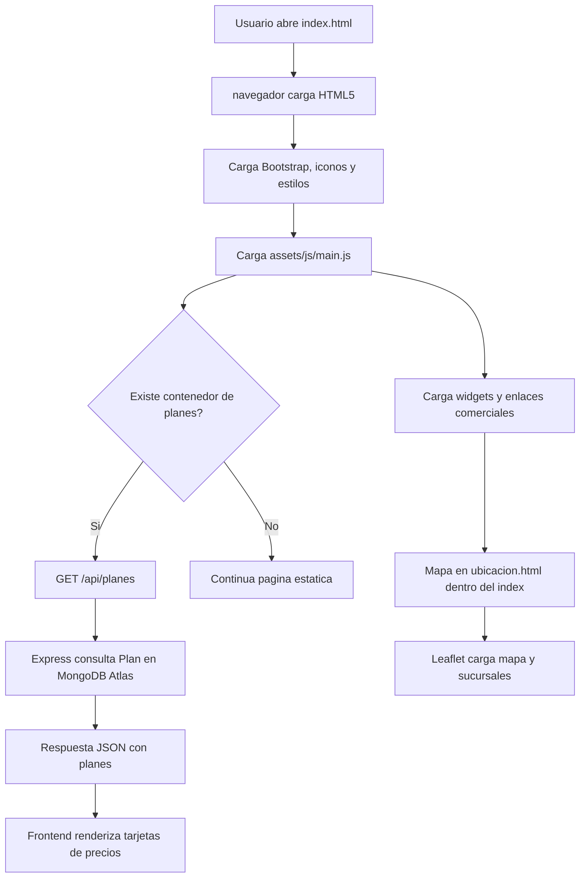
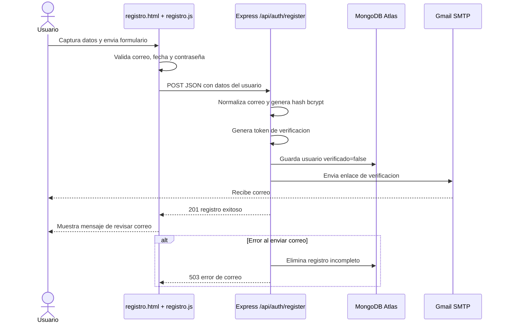
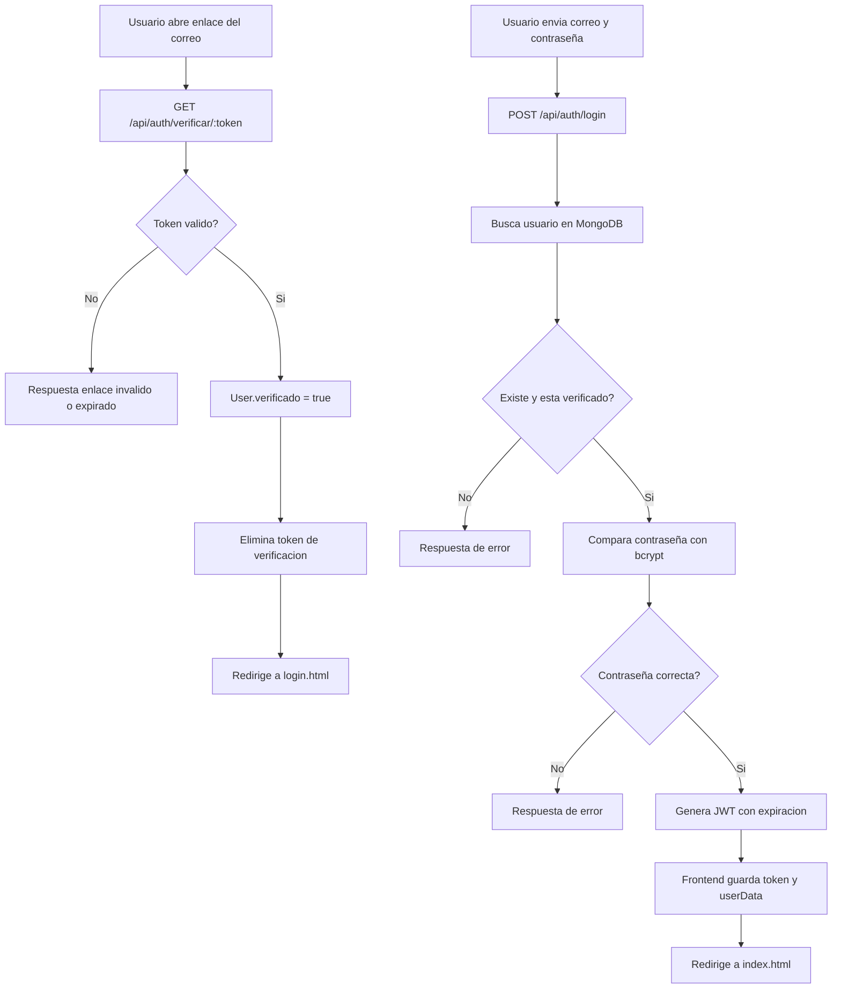
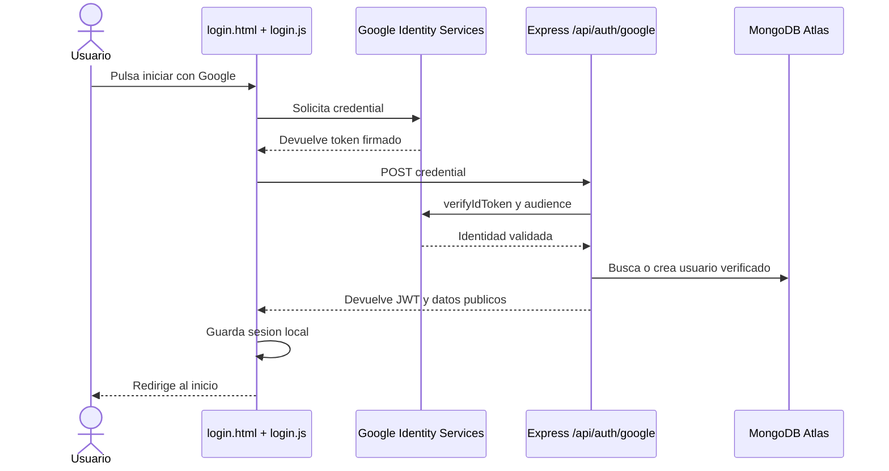
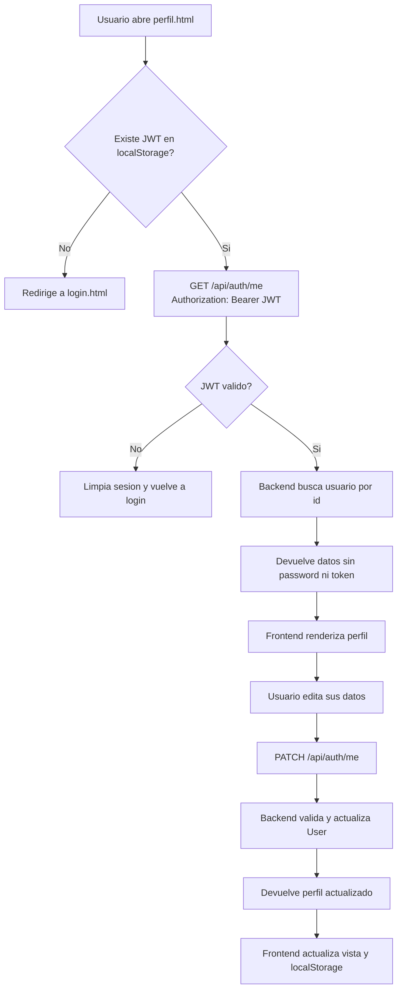
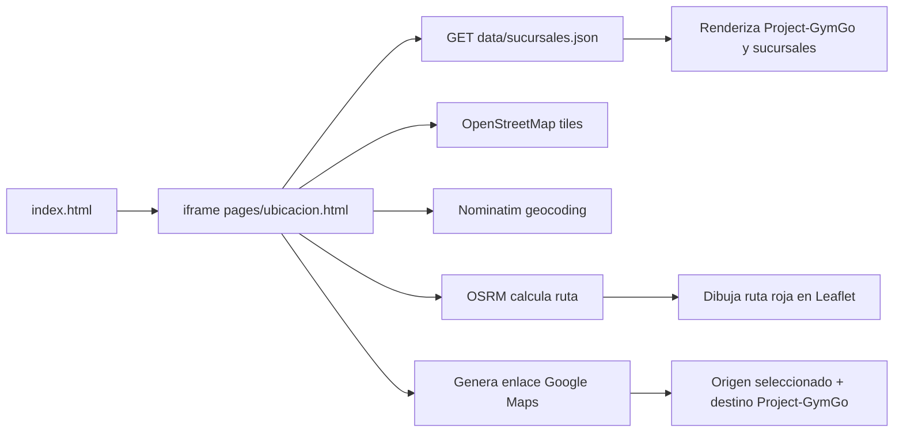

# Diagrama de bloques: Frontend y Backend

**Proyecto:** Project-GymGo  
**Empresa:** SIRID Systems  
**Arquitectura:** Frontend estatico HTML5, CSS y JavaScript + API Node.js/Express + MongoDB Atlas.

## 1. Arquitectura general

```mermaid
flowchart LR
    Usuario[Administrador o visitante del gimnasio]:::actor

    subgraph Frontend[Frontend web de ventas]
        Inicio[index.html\nLanding comercial]:::page
        Paginas[Paginas HTML5\nprecios, demo, contacto, ubicacion]:::page
        AuthUI[Login y registro]:::auth
        PerfilUI[Perfil de usuario]:::auth
        JS[JavaScript del navegador\nfetch, validacion, localStorage]:::logic
        UI[Bootstrap, estilos e iconos]:::ui
    end

    subgraph Backend[Backend de SIRID Systems]
        Express[Node.js + Express\nserver.js]:::server
        AuthAPI[/api/auth\nlogin, registro, Google, perfil]:::api
        PlansAPI[/api/planes\nconsulta de planes]:::api
        VerifyAPI[/api/auth/verificar/:token\nconfirmacion de correo]:::api
        JWT[JWT\nautenticacion protegida]:::security
        Models[Modelos Mongoose\nUser y Plan]:::model
    end

    Mongo[(MongoDB Atlas\nusuarios, planes y estados)]:::database
    Google[Google Identity Services\nOAuth 2.0]:::external
    Gmail[Gmail SMTP\ncorreo de verificacion]:::external
    Maps[OpenStreetMap, Nominatim y OSRM\nmapa, busqueda y rutas]:::external
    WhatsApp[WhatsApp y correo comercial]:::external

    Usuario --> Inicio
    Usuario --> Paginas
    Usuario --> AuthUI
    Usuario --> PerfilUI
    Inicio --> JS
    Paginas --> JS
    AuthUI --> JS
    PerfilUI --> JS
    UI --> Inicio
    JS -->|HTTPS fetch / JSON| Express
    Express --> AuthAPI
    Express --> PlansAPI
    Express --> VerifyAPI
    AuthAPI --> JWT
    AuthAPI --> Models
    PlansAPI --> Models
    VerifyAPI --> Models
    Models --> Mongo
    AuthAPI <-->|credential| Google
    AuthAPI -->|SMTP| Gmail
    VerifyAPI -->|redirect al login| AuthUI
    JS <-->|busqueda, tiles y rutas| Maps
    Usuario --> WhatsApp

    classDef actor fill:#3478c8,color:#fff,stroke:#245b9b,stroke-width:2px;
    classDef page fill:#29999b,color:#fff,stroke:#1d7274;
    classDef auth fill:#dbe8f8,color:#17211b,stroke:#759bc7;
    classDef logic fill:#f1dfb8,color:#17211b,stroke:#c9aa70;
    classDef ui fill:#e8edf0,color:#17211b,stroke:#9aa7ad;
    classDef server fill:#d9b978,color:#17211b,stroke:#ad8d50;
    classDef api fill:#f1dfb8,color:#17211b,stroke:#c9aa70;
    classDef security fill:#f8d7da,color:#17211b,stroke:#b02a37;
    classDef model fill:#e8edf0,color:#17211b,stroke:#9aa7ad;
    classDef database fill:#c8f169,color:#17211b,stroke:#718c2d;
    classDef external fill:#fff,color:#17211b,stroke:#899398;
``` 

## 2. Flujo de carga de la página comercial



## 3. Flujo de registro tradicional



## 4. Flujo de verificación e inicio de sesión



## 5. Flujo de inicio con Google



## 6. Flujo de perfil protegido



## 7. Flujo del mapa y ubicación



## 8. Flujo comercial de demo y contacto

```mermaid
flowchart TD
    A[Administrador del gimnasio visita la web] --> B[Revisa plataforma y equipo]
    B --> C[Pulsa Agendar demostracion]
    C --> D[Completa demo.html]
    D --> E{Canal de contacto}
    E --> F[WhatsApp comercial]
    E --> G[project.gymgo@gmail.com]
    F --> H[Demostracion presencial gratuita]
    G --> H
    H --> I{Decision del gimnasio}
    I --> J[Suscripcion de la plataforma]
    I --> K[Compra del equipo]
    I --> L[Renta del equipo]
```

## 9. Resumen de responsabilidades

| Capa | Responsabilidad | Componentes |
|---|---|---|
| Usuario | Navega, registra cuenta, solicita demo y consulta su perfil | Navegador web |
| Frontend | Presenta contenido, valida formularios, consume API y renderiza datos | HTML5, CSS, Bootstrap, JavaScript |
| API | Valida solicitudes, autentica, genera JWT y coordina servicios | Node.js, Express |
| Persistencia | Guarda usuarios, planes, verificacion y datos de perfil | MongoDB Atlas, Mongoose |
| Identidad | Valida cuentas mediante Google | Google OAuth 2.0 |
| Correo | Envia enlaces de verificacion | Gmail SMTP, Nodemailer |
| Geolocalizacion | Muestra mapa, busca origen y calcula rutas | Leaflet, OpenStreetMap, Nominatim, OSRM |
| Comercial | Recibe solicitudes y cierra demos, ventas o rentas | WhatsApp y correo |

## 10. Endpoints backend representados

| Metodo | Endpoint | Funcion | Proteccion |
|---|---|---|---|
| `POST` | `/api/auth/register` | Crear cuenta y enviar verificacion | Publico |
| `GET` | `/api/auth/verificar/:token` | Confirmar correo | Token de verificacion |
| `POST` | `/api/auth/login` | Iniciar sesion tradicional | Publico |
| `POST` | `/api/auth/google` | Iniciar sesion con Google | Credential de Google |
| `GET` | `/api/auth/me` | Consultar perfil | JWT |
| `PATCH` | `/api/auth/me` | Editar perfil o contraseña | JWT |
| `GET` | `/api/planes` | Obtener planes comerciales | Publico |
| `GET` | `/api/status` | Diagnostico del servidor | Publico |
