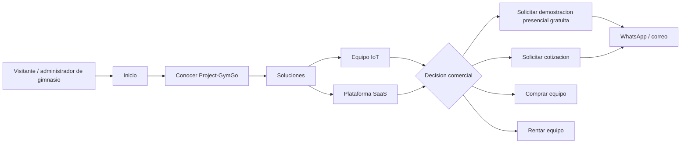
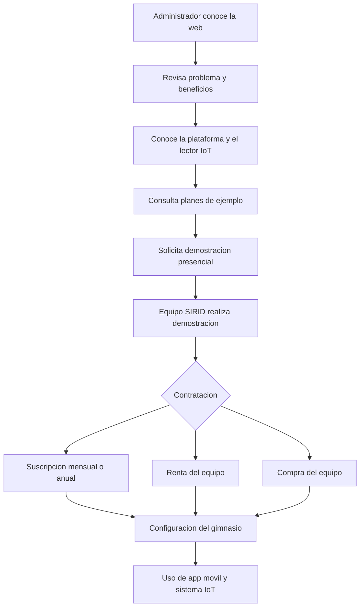

# Mapa del sitio de Project-GymGo

**Empresa:** SIRID Systems  
**Producto:** Project-GymGo  
**Modelo:** Plataforma B2B para gimnasios con suscripcion mensual y equipo de control de acceso IoT.

> Para el flujo tecnico entre frontend, backend, base de datos y servicios externos, consulta [Diagrama de flujo Frontend y Backend](diagrama-flujo-frontend-backend.md).

> Para el proceso de investigacion y validacion del producto, consulta [Diagrama de Design Thinking](diagrama-design-thinking.md).

## Diagrama principal

```mermaid
flowchart TB
    Inicio[Inicio / index.html\nPropuesta comercial]:::principal

    Inicio --> Soluciones[Soluciones para gimnasios\nsoluciones.html]:::navegacion
    Inicio --> Hardware[Equipo Project-GymGo\nhardware.html]:::navegacion
    Inicio --> Beneficios[Beneficios del ecosistema\nseccion #beneficios]:::navegacion
    Inicio --> Precios[Planes y precios\nseccion #precios / precios.html]:::navegacion
    Inicio --> Demo[Solicitar demostracion\ndemo.html]:::conversion
    Inicio --> Contacto[Contacto comercial\ncontacto.html]:::conversion
    Inicio --> Ubicacion[Ubicacion y cobertura\nubicacion.html]:::navegacion
    Inicio --> Login[Iniciar sesion\nlogin.html]:::acceso

    Soluciones --> Plataforma[Plataforma para gimnasios\nAdministracion, coaches y datos]:::secundaria
    Soluciones --> IoT[Control de acceso IoT\nQR generado por la app y lector fisico]:::secundaria
    Soluciones --> Analitica[Analitica de afluencia\nDatos para operar mejor]:::secundaria

    Hardware --> Compra[Comprar equipo]:::conversion
    Hardware --> Renta[Rentar equipo]:::conversion
    Hardware --> Demo

    Precios --> Cotizacion[Solicitar cotizacion]:::conversion
    Precios --> Demo
    Precios --> Compra
    Precios --> Renta

    Demo --> FormDemo[Formulario de demostracion\nPresencial y gratuita]:::secundaria
    FormDemo --> Contacto
    Contacto --> WhatsApp[WhatsApp comercial]:::externo
    Contacto --> Correo[project.gymgo@gmail.com]:::externo
    Ubicacion --> Cobertura[Mixquiahuala, Tlaxcoapan,\nTlahuelilpan, Progreso y alrededores]:::secundaria

    Login --> Registro[Crear cuenta\nregistro.html]:::acceso
    Login --> Google[Inicio con Google]:::externo
    Login --> Perfil[Mi perfil\nperfil.html]:::privado
    Perfil --> Datos[Editar datos personales]:::privado
    Perfil --> Seguridad[Cambiar contrasena]:::privado
    Login --> Admin[Panel administrativo\nadmin.html]:::privado
    Admin --> Graficas[Graficas de operacion]:::privado
    Admin --> Planes[Gestion de planes]:::privado

    Terminos[Terminos y condiciones\nterminos.html]:::legal
    Inicio --> Terminos

    classDef principal fill:#3478c8,color:#fff,stroke:#245b9b,stroke-width:2px;
    classDef navegacion fill:#29999b,color:#fff,stroke:#1d7274,stroke-width:1px;
    classDef conversion fill:#d9b978,color:#17211b,stroke:#ad8d50,stroke-width:1px;
    classDef secundaria fill:#f1dfb8,color:#17211b,stroke:#c9aa70,stroke-width:1px;
    classDef acceso fill:#dbe8f8,color:#17211b,stroke:#759bc7,stroke-width:1px;
    classDef privado fill:#e8edf0,color:#17211b,stroke:#9aa7ad,stroke-width:1px;
    classDef externo fill:#fff,color:#17211b,stroke:#899398,stroke-width:1px;
    classDef legal fill:#fff,color:#17211b,stroke:#899398,stroke-width:1px;
```

## Jerarquia comercial



## Flujo del cliente B2B



## Separacion entre web y app movil

### Web de ventas: fase actual

- Promocionar Project-GymGo y SIRID Systems.
- Explicar la plataforma SaaS para gimnasios.
- Presentar el equipo de control de acceso.
- Mostrar planes y precios de ejemplo.
- Recibir solicitudes de demostracion presencial.
- Recibir solicitudes de compra o renta.
- Atender consultas por WhatsApp y correo.
- Mostrar cobertura geografica.
- Permitir autenticacion y perfil cuando corresponda.

### App movil: producto futuro

- Rutinas personalizadas y Coach Creator.
- QR dinamico para acceso.
- Check-in y check-out.
- Registro del entrenamiento.
- Rachas y gamificacion.
- Mapas de calor y sustitucion de ejercicios.
- Pagos de usuarios del gimnasio.
- Notificaciones push y upselling.
- Reportes de mantenimiento.
- IA para analisis de postura, como fase posterior.

## Estado de paginas

| Pagina o modulo | Ruta | Estado | Proposito |
|---|---|---|---|
| Inicio | `index.html` | Disponible | Presentacion comercial |
| Precios | `pages/precios.html` | Disponible | Planes de ejemplo |
| Demo | `pages/demo.html` | Disponible | Solicitud comercial |
| Contacto | `pages/contacto.html` | Disponible | Comunicacion |
| Ubicacion | `pages/ubicacion.html` | Disponible | Cobertura y mapa |
| Login | `pages/login.html` | Disponible | Acceso de cuenta |
| Registro | `pages/registro.html` | Disponible | Crear cuenta |
| Perfil | `pages/perfil.html` | Disponible | Datos de usuario |
| Terminos | `pages/terminos.html` | Disponible | Informacion legal |
| Administracion | `pages/admin.html` | En desarrollo | Operacion del gimnasio |
| Soluciones | `pages/soluciones.html` | Pendiente | Pagina comercial enlazada desde Inicio |
| Hardware | `pages/hardware.html` | Pendiente | Pagina del equipo IoT enlazada desde Inicio |

> `soluciones.html` y `hardware.html` aparecen enlazadas desde `index.html`, pero todavia deben crearse para que el mapa de navegacion quede completo.
